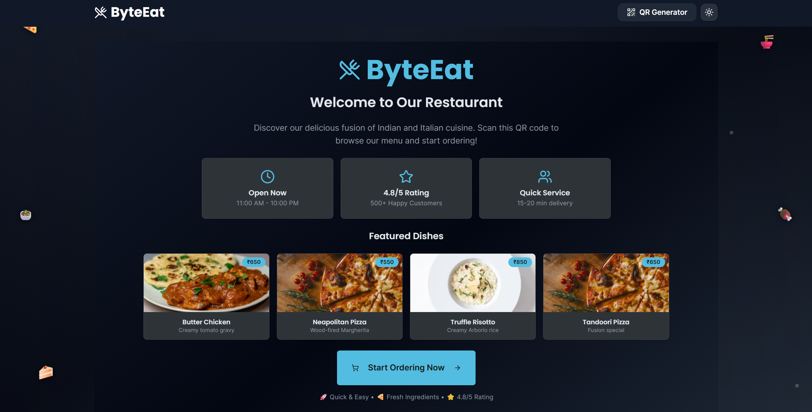

# ByteEat 🍕 – Smart Restaurant Ordering
ByteEat is a modern, full-stack web application that streamlines the restaurant ordering process. Users can scan a QR code, browse a visually rich menu, customize items, manage their cart, and enjoy a seamless checkout—all with a beautiful, responsive, and performant UI.

[](https://byte-eat.vercel.app/)
[](https://github.com/Rabikiran67/Byte-Eat)

## 📸 App Screenshots

| Landing Page |
|-------------|
|  |

| Home Page | Menu Page |
|-----------|-----------|
|  |  |

| Empty Cart | Cart with Items |
|------------|----------------|
|  |  |


---

## ✨ Features

- **Interactive Menu:** Browse categorized food items with images, descriptions, and customizations.
- **Food-Themed Loading Spinner:** Enjoy a unique, animated pizza-slice spinner on every page load and route transition for a delightful, branded experience.
- **Global & Per-Page Loading:** Smooth loading overlays appear globally and on key pages, ensuring users always know when content is loading.
- **Cart Management:** Add, remove, and update items in a persistent cart (localStorage-backed).
- **Table Number Input:** Specify your table before checkout for a real-world restaurant feel.
- **Simulated Checkout & Confirmation:** Experience a mock payment and order summary flow.
- **Review Submission:** Leave feedback after your order (simulated).
- **Dark Mode:** Modern dark mode UI, defaulting to dark for a premium look.
- **Responsive Design:** Fully optimized for mobile, tablet, and desktop.
- **Admin Panel:** (Optional) Admin login for QR code generation and management.

---

## 🛠️ Tech Stack

- **Framework:** [Next.js 15](https://nextjs.org/) (App Router, server/client components)
- **UI Library:** [React](https://react.dev/)
- **Styling:** [Tailwind CSS](https://tailwindcss.com/) with custom animations
- **UI Components:** [ShadCN UI](https://ui.shadcn.com/)
- **Icons:** [Lucide React](https://lucide.dev/)
- **State Management:** React Context API + [immer](https://immerjs.github.io/immer/)
- **TypeScript:** Full type safety

---

## 🚀 Getting Started

### Prerequisites
- Node.js (v18 or later recommended)
- npm (or yarn)

### Installation
1. **Clone the repository:**
   ```bash
   git clone https://github.com/Rabikiran67/Byte-Eat.git
   cd Byte-Eat
   ```
   Or download and navigate to the project root.
2. **Install dependencies:**
   ```bash
   npm install
   ```

### Running the Development Server
```bash
npm run dev
```
Visit [http://localhost:9002](http://localhost:9002) in your browser.

---

## 🍕 Custom Food-Themed Loading Spinner

ByteEat features a custom, animated pizza-slice spinner for a delightful, branded loading experience. This spinner appears:
- **Globally:** On initial load and every route transition (see `src/components/layout/GlobalLoadingOverlay.tsx`).
- **Per-Page:** On key pages via `loading.tsx` files (e.g., `src/app/menu/loading.tsx`).

**How it works:**
- The spinner is a React SVG component (`src/components/ui/FoodSpinner.tsx`) with smooth, custom CSS animation (`animate-spin-slow` in `globals.css`).
- The global overlay is a client component that detects route changes and overlays the spinner with a subtle dark background and blur.
- All animations are handled via Tailwind CSS and global CSS for maximum performance and SSR compatibility.

---

## 🖌️ UI/UX Polish & Performance
- **Modern, accessible design** with Tailwind and ShadCN UI.
- **Custom animations** for loading, cards, and backgrounds (see `globals.css`).
- **Persistent cart** using localStorage.
- **Optimized images** and lazy loading for fast LCP.
- **No hydration mismatches:** All client/server boundaries are respected for smooth SSR/CSR.

---

## 📜 Available Scripts
- `npm run dev` – Start the dev server
- `npm run build` – Build for production
- `npm run start` – Start the production server

---

## ☁️ Deployment
- **Vercel:** Recommended for Next.js (connect your repo, deploy instantly)

---

## 🤝 Contributing
Contributions, issues, and feature requests are welcome! Please open an issue or PR.

---

## 📄 License
This project is licensed—see LICENSE.md (if present) or contact the author for details.

---

Enjoy using ByteEat! 🍽️
